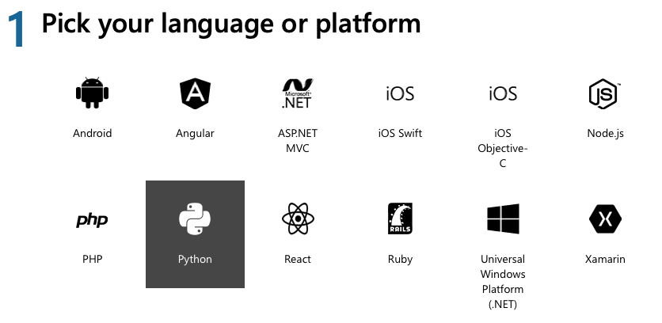
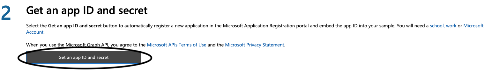
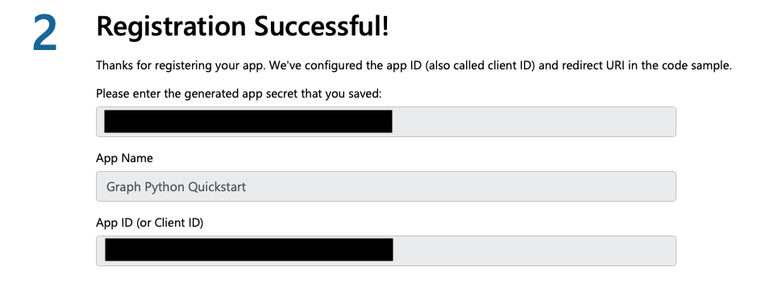

# Microsoft Graph Module

Scrapes Outlook for notifications.

## Development Installtion 🔧
1. Register a MS Graph app
    - Go to the [MS Graph Quick Start](https://developer.microsoft.com/en-us/graph/quick-start?platform=option-Python)
    - Select Python
    
    - Select *Get an app ID and secret*
    
    - Signin using your Cision email
    - Copy the app secret and App ID
    

2. Setup the Credentials
    - Create a file called `oauth_settings.yml`, and paste the app secret and App ID that you got from the previous step
    - Save the oauth_settings.yml file to the parent directory

```yml
app_id: "YOUR APP ID HERE"
app_secret: "YOUR APP SECRET HERE"
redirect: "http://localhost:8000/callback"
scopes:
  - user.read
  - mailboxsettings.read
  - calendars.readwrite
authority: "https://login.microsoftonline.com/common"
```

> Note: do NOT save the yml file to the `./ms_graph_module` directory

3. Install the Required Packages 
    - (Optional) [Set up a virtual environment](https://docs.python.org/3/library/venv.html)
    - Enter `pip3 install -r requirements.txt` in the command line to install all the required packages

4. Run the Server
    - Run `python3 manage.py runserver` to spin up the server

5. Initialze the Database
    - Use `manage.py` to initialize an sqlite database on your machine using the `python3 manage.py migrate` command